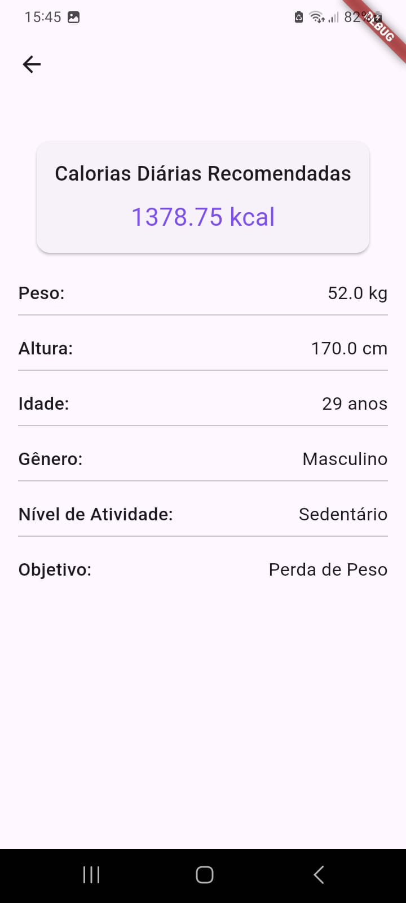
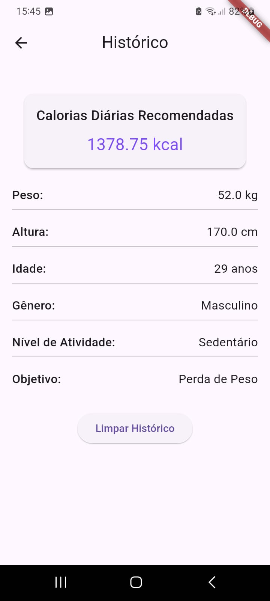

# Calorie Calculator App

### Aplicativo desenvolvido em Flutter

Este é um aplicativo Flutter que calcula a quantidade diária recomendada de calorias com base nos dados físicos do usuário e seu objetivo (perda ou ganho de peso). O app armazena o último cálculo localmente, permitindo ao usuário visualizar ou limpar o histórico

## Funcionalidades

- **Cálculo de Calorias:** Com base em peso, altura, idade, gênero, nível de atividade física e objetivo (perda ou ganho de peso).
- **Histórico Local:** Armazena o último cálculo realizado e permite visualizá-lo em uma tela separada.
- **Limpar Histórico** O usuário pode limpar o histórico de cálculos anteriores.

## Capturas de Tela


*Página de dados do usuário*


*Tela de resultado do calculo*


*Tela de histórico*


*Tela de histórico vazia*

## Como Rodar o Projeto

Siga os passos abaixo para rodar o aplicativo localmente:

1. **Clone o repositório:**

   ```bash
   git clone https://github.com/RafaellaBarbosa/calorie_calculator.git
   ```

2. **Instale as dependências:**

   No diretório do projeto, execute:

   ```bash
   flutter pub get
   ```

3. **Execute o projeto:**

   Para rodar o aplicativo no seu dispositivo/emulador:

   ```bash
   flutter run
   ```

## Gerar APK para Testes

1. **Configurar o Ambiente:**

  Certifique-se de que o ambiente Flutter esteja configurado corretamente com o SDK do Flutter e o Android Studio.

2. **Gerar o APK de Release:**

  Execute o seguinte comando para gerar o APK:

   ```bash
   flutter build apk --release
   ```

3. **Encontrar o APK:**

O APK gerado estará localizado em:

   ```bash
   build/app/outputs/flutter-apk/app-release.apk
   ```
4. **Instalar o APK:**

   Copie o APK para o dispositivo Android e instale-o.


## Tecnologias Utilizadas

- **Flutter**: Framework para desenvolvimento multiplataforma (Android/iOS).
- **Dart**: Dart: Linguagem de programação usada pelo Flutter.
- **Shared Preferences**: Armazenamento local para manter o histórico do último cálculo.